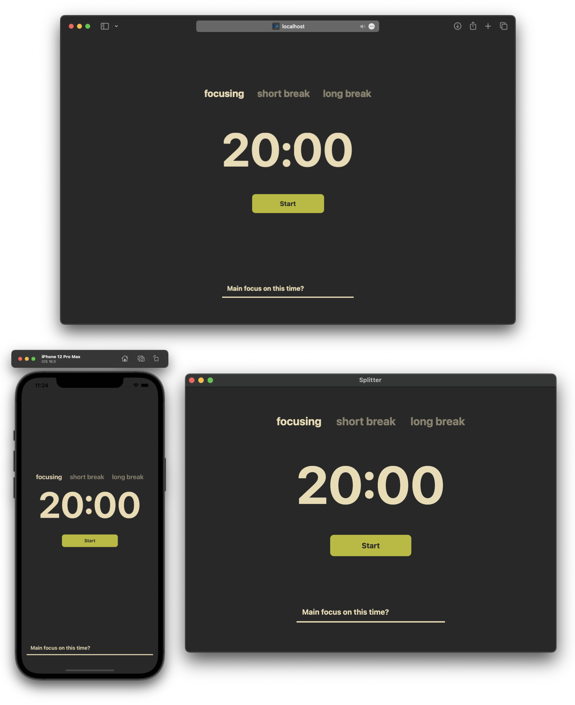

<a href="https://github.com/povalish/splitter">
  
</a>

# Splitter App
Simple tomato-style timer. 
**Splitter App** is cross-platform app for iOS/Adnroid, OSX/WIndows, Web written on TypeScript and used single code base for all platforms. 

**Main goal** for this project is explore tools/frameworks and connect them to work together on different plaforms. Also [design](https://www.figma.com/file/EIPyqa5kNGXsa5QOWzEq1f/Splitter?type=design&node-id=137%3A14&mode=design&t=EDyFusdJR6QMGEry-1) handcrafted by my own.

Figma - https://www.figma.com/file/EIPyqa5kNGXsa5QOWzEq1f/Splitter?type=design&node-id=137%3A14&mode=design&t=EDyFusdJR6QMGEry-1




## Table Of Content

- [Tech Stack](#tech-stack)
  - [Core](#core)
  - [Web](#web)
  - [Desktop](#desktop)
  - [Mobiles](#mobiles)
  - [Storybook](#storybook)

- [Installation](#installation)
  - [Environment](#environment)
  - [React Native](#react-native)

- [Project Structure](#project-structure)
  - [NX Workspace](#nx-workspace)
  - [Apps](#apps)
  - [Libs](#libs)

- [How to run](#how-to-run)
  - [Web App](#web-app)
  - [Desktop App](#desktop-app)
  - [Mobile Apps](#mobule-apps)
  - [Storybook for React](#storybook-for-react)
  - [Storybook for React Native](#storybook-for-react-native)
  - [Unit Tests](#unit-tests)
  - [E2E Tests](#e2e-tests)


## Tech Stack

The main idea here was to use tools and libraries that work well with React on different platforms.

Some tools were picked because I like them and it was interesting for me to "connect" them with different platfoms and other tools.


### Core

Basic tools
- [eslint](https://eslint.org/docs/latest/use/getting-started)
- [prettier](https://prettier.io/docs/en/install)

Frontend tooks
- [tailwind css](https://tailwindcss.com) for styling
- [react-hook-form](https://www.react-hook-form.com) for form validation
- [mobx](https://mobx.js.org/README.html) for state management 
- [jest](https://jestjs.io) for unit tests
- [nx worksapce](https://nx.dev) for build this monorepo
- [storybook](https://storybook.js.org)

Core tools/libs
- [react](https://react.dev)
- [react native](https://reactnative.dev)
- [electron](https://www.electronjs.org)
- [vite](https://vitejs.dev)
- [nextJS](https://nextjs.org)


### Web

For web app used [NextJS](https://nextjs.org) Framerwork.


### Desktop

For creating desktop app used [Electron](https://www.electronjs.org) with [Electron Builder](https://www.electron.build/index.html) tool. For building React code used [Vite](https://vitejs.dev).


### Mobiles

Just usual [React Native](https://reactnative.dev).

### Storybook

[Storybook](https://storybook.js.org) is perfect tool for creating ui elements in an isolated environment. Works well with default html-like comoponents and react-native components.


## Installation

### Environment

First of all setup and install NodeJS for your OS.
Follow the instructions [here](https://nodejs.org/en).

I use [Warp](https://www.warp.dev) as a terminal, but it's only for OSX. As an alternative - [iTerm](https://iterm2.com) or [Neovim](https://www.youtube.com/watch?v=ajmK0ZNcM4Q).

Package manager - [Yarn](https://yarnpkg.com/getting-started/install). You can use any other package manager, and change Yarn-commands to yours.


### React Native

React Native's team wrote good and well-detailed instructions [here](https://reactnative.dev/docs/environment-setup).


## Project Structure

### NX Workspace 

For building core blocks of this project used [NX Workspace](https://nx.dev).


### Apps

In the **App** folder placed:
- Mobile app
- Desktop app
- Web app
- Storybook for plain React component
- Storybook for React Native component

### Libs

In the **Libs** placed:
- Module folder business logic components, each module containes pieces
  - views
  - hooks
  - types
  - utils
- UI Kit, each ui component contains following parts
  - react component
  - react native component
  - interface file with types
  - file with [tailwind](https://tailwindcss.com) classes
  - unit tests for each react/react-native components


## How to run

Before run any command

```bash
$ yarn install
```

### Web App

```bash
$ npx nx run web:start # start dev server
$ npx nx run web:build # build static site
```

### Desktop App
```bash
$ npx nx run desktop:start # start electron app for development
$ npx nx run desktop:package # build binary file
```

### Mobile App
```bash
$ npx npx nx run mobile:start # start dev server, need to run before start iOS/Android app
$ npx nx run mobile:run-android # start android app
$ npx nx run mobile:run-ios # start ios app
```

### Storybook for React
```bash
$ npx nx run storybook-react:build # build stories
$ npx nx run storybook-react:start # start storybook for react components
```

### Storybook for React Native
```bash
$ npx nx run storybook-native:build # build stories
$ npx nx run storybook-native:start # start dev server
$ npx nx run storybook-native:run-android # run storybook on android
$ npx nx run storybook-native:run-ios # run storybook on ios
```


## Unit Tests

```bash
$ npx nx run mobile:test
$ npx nx run desktop:test
$ npx nx run web:test
$ npx nx run mobules:test
$ npx nx run ui-kit:test
```


## E2E Tests
```bash
$ npx nx run web-e2e:run
$ npx nx run desktop-e2e:run
$ npx nx run mobile-e2e:run
$ npx nx run mobile-e2e:test-android
$ npx nx run mobile-e2e:test-ios
```